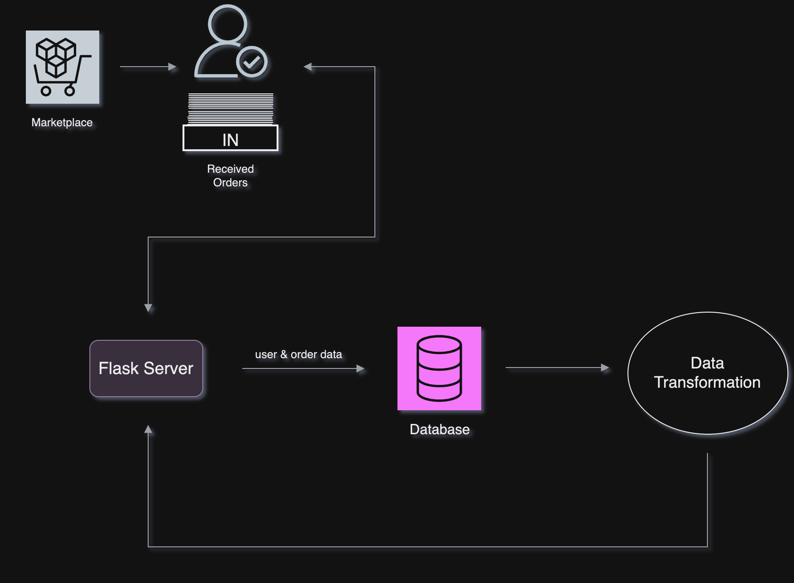
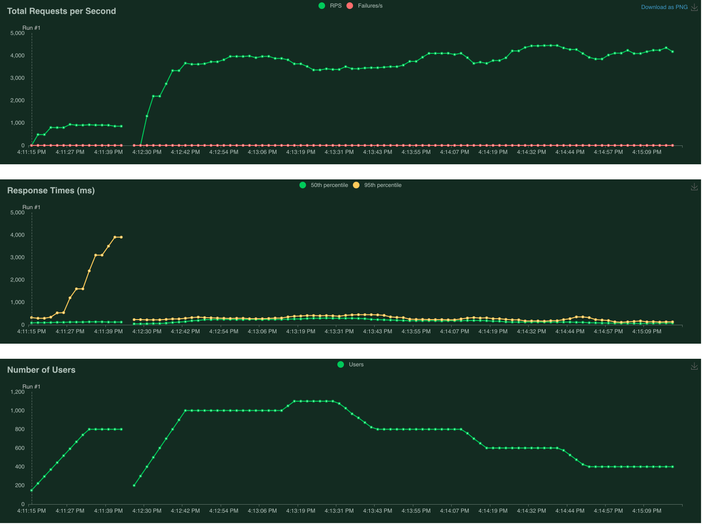

# Microservice

[](https://github.com/mkeohane01/IDS706-Microservice/actions/workflows/workflow-name.yml)
[](https://github.com/mkeohane01/IDS706-Microservice/actions/workflows/workflow-name.yml)
[](https://github.com/mkeohane01/IDS706-Microservice/actions/workflows/workflow-name.yml)
[](https://github.com/mkeohane01/IDS706-Microservice/actions/workflows/workflow-name.yml)
[](https://github.com/mkeohane01/IDS706-Microservice/actions/workflows/continuousdelivery.yml)


## Description

Our microservice leverages Flask to provide a responsive and scalable web interface. This microservice is designed as a core component of a larger distributed system, specifically focused on handling product order processing. It acts independently but is seamlessly integrated with the overall data pipeline, offering high responsiveness and efficiency. It's engineered to handle user inputs such as product selections and shipping details. Once an order is placed, it's processed and stored in a SQL database. The service then performs data transformations to provide valuable insights like the top three popular products in a customer's state, enhancing the user experience. 

## Architecture



The provided architectural diagram visually represents our system's components: the web interface, Flask server, database, and data processing modules. These components interact to offer a streamlined order handling process, from user input through data storage and analysis.

## Usage

The app is cloud hosted using Azure at https://shopnozama.azurewebsites.net/. Here users will be able to place orders for any product in the drop down menu which display an image and price. From there after submitting the form, users will be redirected to their confirmation page base on their unique order number. 
"/orders/<order_num>"

Locally, you can also run the app by either building the Docker file or installing requirements.txt manually and running ```python src/main.py```. Here the same application will be hosted at localhost:5000 in development mode. 
- Note: in order to use the application locally, need to create a .env file with the DB username and password to connect to the cloudhosted DB.

When the app is hosted, a log file is generated and automatically updated with useful information found in src/app.log
### Example


### Makefile
`make install` to install, `make lint` to lint, `make format` to format, `make test` to perform tests

### Database
We host our database on Azure, using a general purpose V5 instance with 2 cores. Our database has two tables, one which stores all of the products, and one which keeps track of all of the orders that are placed. 

## Load Testing

### Objective: Achieving 10,000 Requests Per Second

Through our streamlined load testing process, accessible via `make` commands, we've rigorously evaluated our service's performance under high-traffic scenarios. Here's what we discovered:

- Flask Server Health Check: Using `make load_test`, we can push over 5,000 requests per second, showcasing robust responsiveness.
- Full Data Pipeline Performance: With `make load_test_datapipe_gui`, we observed a throughput of 200 requests per second. This is primarily constrained by the database's capacity for data storage and retrieval and spending limits.

- We were able to get to about 4600 requests per second by using 18 instances of a premium azure web app, while implementing some load management strategies. Unfortunately, this costs quite a bit of money, and therefore we have since scaled back to manage the cost. With access to more instances, and perhaps a more expensive instance type, we may be able to reach 10,000, but at the momenet we lack the funds to accomplish this task. A graph of the performance using locust at our peak is shown below:
 


### Interactive Testing Tools:

- `make load_test_gui`: Launches an intuitive, locally-hosted interface for real-time load testing and analysis of the Flask server.
- `make load_test_datapipe_gui`: Extends this capability to the entire data pipeline, offering a hands-on, visual approach to performance assessment.

Each tool is designed to give us a comprehensive understanding of our system's limits and areas for improvement, guiding us toward our ultimate goal of 10,000 requests per second.

## Data Engineering 

We utilize pyodbc for its robust SQL Server connectivity powered by Azure, facilitating efficient data transactions and storage. This choice enhances our system's ability to handle large volumes of data with high reliability. 

## Infrastructure as Code (IaC)

Our project employs Azure Resource Manager (ARM) for infrastructure management, allowing us to define and deploy all necessary infrastructure resources programmatically and reliably. We have the infrastructure defined in ARM_IaC.json and can push changes directly to Azure through their CLI or initialize new instances with the same parameters.

To use Azure CLI to deploy an instance using ARM:
```bash
az login
ax deployment group create \
    --resource-group <Azure resource group name>
    --template-file ARM_IaC.json
    --parameters webAppName=<name of app> appServicePlanName=<name of service plan> location=<server location> dockerImage=<docker image to deploy>
```
ARM_IaC.json has default values for our specific project so can be deployed (if we are logged in) without filling in your specifc parameters.

## Continuous Integration and Continuous Delivery (CI/CD)

Our CI/CD pipeline, built with GitHub Actions, automates our development lifecycle processes. The workflows in .github/workflows – namely format.yml, install.yml, lint.yml, continuousdelivery.yml, and test.yml – ensure consistent code quality and streamlined deployment.

Our web application automatically detects changes in dockerhub, and because we continuously deliver to docker, we thereby continuously deliver to our web app on Azure.

## Dockerization

We used Distroless Docker images to containerize the microservice, focusing on security and minimalism. The Dockerfile provided in the repository guides you through building and running the Docker container, encapsulating all dependencies.

## Limitations and Improvements

At present, our microservice is tailored for optimal performance with SQL databases. This specialization, while efficient, narrows our compatibility with diverse database systems. Looking ahead, we are focusing on two pivotal enhancements:

1. Better Database Integration: Future updates to improve robustness of our database including hosting the pipeline through Databricks and DeltaLakes. This expansion will not only improve our data management capabilities but also cater to a wider range of application requirements. We also can load the data in batches to improve high load volumes.

2. Advanced Data Analytics Features: Alongside improved database support, we aim to incorporate sophisticated data analytics functionalities. This could involve integrating with databases designed for large-scale data processing, such as Apache Hadoop or Google BigQuery, enhancing our ability to handle complex data sets and deliver deeper insights.

These advancements will position our microservice as a more versatile and powerful tool, capable of seamlessly integrating with a range of database ecosystems and addressing more complex data analysis needs.

## AI Code Helpers

Throughout this project, we worked closely with AI - LLM tools. Copilot, integrated in to VSCode, is great at providing frameworks to build functions based on commented commands along with just improving workflows with line-by-line autocomplete directly in the IDE. 

Another tool which helped us a lot throughout the project was ChatGPT, specifically GPT4. We used this to help skeleton out more specific files such as the ARM and workflows because we could upload certain information for it to use. ChatGPT is also great at talking through ideas as well as getting help creating css and styling for the front end.

Overall incorporating Large Language Models in to our workflows allowed us to be a lot more productive in a short amoount of time. We could brainstorm ideas with it, prompt it to outline code files, as well as talking through it for help debugging.

## Teamwork Reflection

Our teamwork journey highlights the collaborative efforts, challenges overcome, and key learnings acquired during the project development.

[Team Feedback Summary Session](https://docs.google.com/document/d/1FhYV9NSEcUmWtFA6TKe7yPiDxYkE_7HvlgDf3IihQFo/edit?usp=sharing)

[Mike Keohane Team Reflection](https://docs.google.com/document/d/1ixz9MsmHOmnCAyjcn5keo54dAh_d98hUWenSYfierVU/edit?usp=sharing)

[Daniel Medina Team Reflection](https://docs.google.com/document/d/1ViY7u3oRpLIyjkn9Te6N8OfZiC_zlpbdrlPW3Pj0jus/edit?usp=sharing)

[Nick Strauch Team Reflection](https://docs.google.com/document/d/11x82q40JyLOvZKL-fGyUzPQr8a5qsNOlg0JN-oE_UN0/edit?usp=sharing)

[Nick Conterno Team Reflection](https://docs.google.com/document/d/1jnJnaYOIGLPxsWdKwUis8FfXEBNhDxDolO_yqYPvaAE/edit?usp=sharing)

[Tommy McGuire Team Reflection](https://docs.google.com/document/d/1VeugUnDxT4jfaOQPQwAEz4hCPmvNAvmbmUhytG7h_2Y/edit?usp=sharing)
